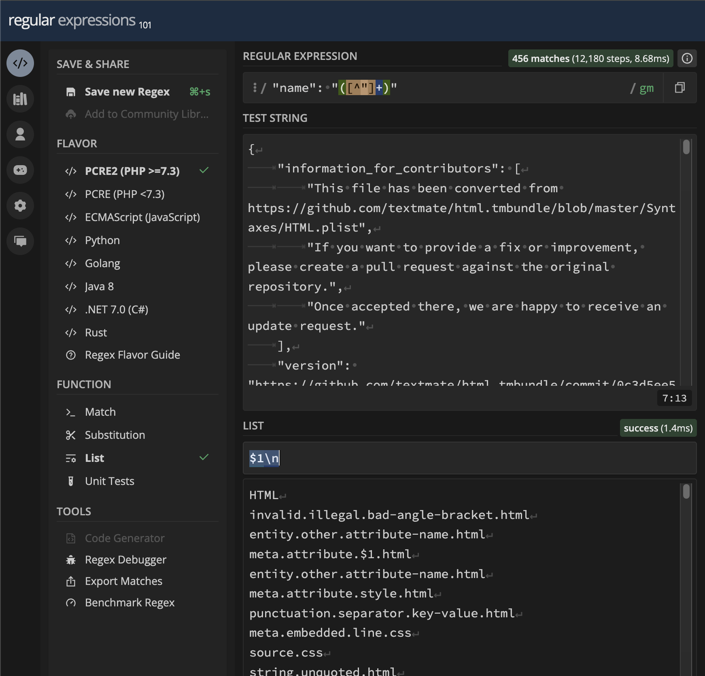
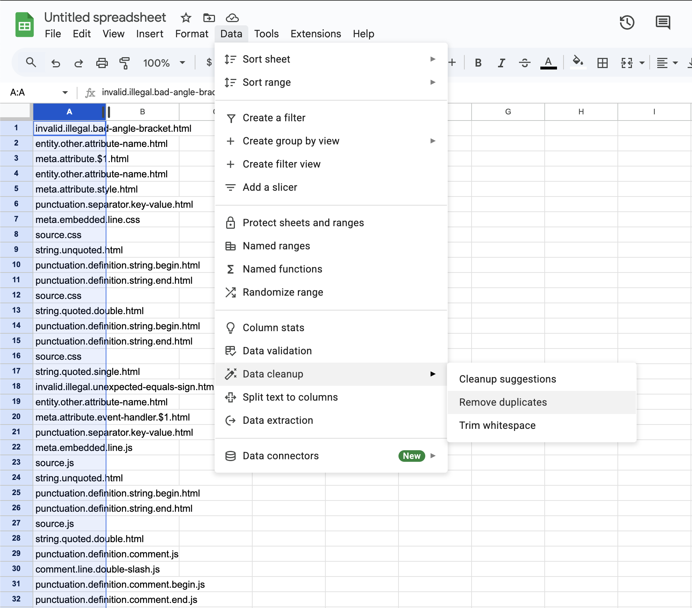

# Embedding a New Language

iui has special syntax supporting directly embedding languages:

```
title = try js.evaluateExpression(*(
  document.querySelector('h1').innerText
)*)
```

This embedded syntax has support for syntax highlighting and even autoformatting.

iui officially supports html, css and js as embedded languages, and the goal is to support as many languages as possible, including niche ones, with major languages available automatically and smaller languages installable via packages.

This guide explains how to add support for a language you need.

## How The Feature Works

The following would not be valid, since it's not possible in the type system to figure out which syntax is being used:

```
a = *(++++++++[>++++++++<-]>+.)*
```

This would fail with the error `Missing type for embedded language`.

Once a type is assigned, it works:

```
a<EmbeddedLanguage.Brainfuck> = *(++++++++[>++++++++<-]>+.)*
```

It wouldn't be typical to need to explicitly provide the name of the embedded language, since generally it would be specified in the type of a function that is later called:

```
runQuery = (query<EmbeddedLanguage.SQL>) => {
  // ...
}

runQuery(*(DELETE FROM users;)*)
```

(Don't run that.)

## The Issue With TextMate Grammars

To add language support to iui, first find the TextMate grammar, written in json, for the language. Most can be found here:

https://github.com/shikijs/textmate-grammars-themes/tree/main

With the syntax highlighting in hand, you might think that we are almost done, however there is some background you need to be aware of.

It's important to understand that TextMate grammars are not smart enough to understand that one embedded language is html: 

```
*(<h1></h1>)*
```

While another is css:

```
*(color: red;)*
```

Telling them apart requires knowing the language types. Only language servers, known as LSPs, are smart enough to know that.

However the architecture of editors like VSCode do not allow LSPs to pass the output of a TextMate Grammar directly (https://github.com/microsoft/vscode/issues/86329).

And even if grammars were smart enough, there are still thorny issues about assuming that the syntax highlighting of embedded languages would "just work" (https://github.com/microsoft/vscode/issues/86329).

To summarize, we have a TextMate grammar but no way to apply it at the LSP stage where it's needed.

## Translating to Semantic Tokens

The TextMate grammar needs to be painstakingly translated, language by language, into a format that LSPs DO support, semantic tokens.

This process will need to be repeated for all nested languages, and all of their nested languages.

Open the TextMate Grammar for your desired language in a code editor.

For example, take a look at the grammar for HTML: https://github.com/shikijs/textmate-grammars-themes/blob/main/packages/tm-grammars/grammars/html.json

First we need to figure out what the embedded languages are.

## Finding Embedded Languages

As you'll see in the TextMate docs, https://macromates.com/manual/en/language_grammars, the include keyword will allow us to determine external languages:

> include — this allows you to reference a different language, recursively reference the grammar itself or a rule declared in this file’s repository.

The value for "include" will be prefixed to distinguish its use. Importantly, references within the grammar itself need to be prefixed with `#`, and `$self` is also allowed.

In the HTML grammar, do a find for `"include"` and note the number of results:


Do a find for `"include": "`


Make sure the number of results doesn't drop. (This might happen due to strange formatting in the document. If it does drop, make sure to check those results manually later.)

Here are some results:

- `"include": "#xml-processing"`
- `"include": "#comment"`
- `"include": "#doctype"`
- `"include": "#cdata"`

Make sure regex is enabled and do a find for `"include": "[^#]`

This will find includes that *don't* start with `#`.


Here are the six results:

- `"include": "source.js"`
- `"include": "source.js"`
- `"include": "source.js"`
- `"include": "source.css"`
- `"include": "source.js"`
- `"include": "text.html.basic"`

Filtering out the duplicates, this means that HTML depends on the grammars for JS and CSS.

The `text.html.basic` is just a reference to itself, so not an additional dependency.

Next, repeat the process for the referenced grammar to get their dependencies.

I checked JS in this way and found no additional dependencies.

In CSS I just found 4 instances of "$self", so no additional dependencies. That means this step is done.

Looking at a number of grammars, they are usually sparing on references to other languages, but your results may vary.

## Creating the List of Rules

For each grammar, we need to create a list of unique rule names.

Similarly to `"include"`, search for `"name"` and take note of the number of results. In HTML, there are 456 results.

Then search for `"name": "` and make sure the number of results doesn't change. If is does change, you'll need to manually handle those.

Next, let's extract the list of names. One good way to do this is to use regex101: https://regex101.com/.

For the regular expression, put `"name": "([^"]+)"`, which selects string next to a given name.

For the test string, put in the full grammar.

In the sidebar, select List, then put `$1\n` to put each match on one line.



The first name will be the name of the grammar itself, and can be ignored. The others will all be names of different rules.

To remove duplicates, one good way is to use Google Sheets, and select "Remove Duplicates".



You can sort the results as well.

## Handling String Replacements

Wherever iui does string replacements, we need to figure out some syntactically valid content to insert in there to make sure the TextMateGrammar doesn't freak out.


For example:

```
js.evaluateExpression(*(
  const environment = *{environment}
)*)
```

Naively stripping out the iui string replacement here would leave an invalid bit of JS behind:

```
"const environment ="
```

That is invalid with the error `SyntaxError: Unexpected end of input`.

In addition to screwing up highlighting, this would prevent autoformatters from working as well.

This needs to be repeated for every language embedded in the language. For example, HTML has embedded JS (via `<script></script>` tags) and CSS (via `<style></style>` tags).


With the syntax highlighting in hand, you might think that we are almost done, however there is some background you need to be aware of.

There are two main types of syntax highlighting, TextMate grammars and semantic tokens.

TextMate grammars run instantly, and are run by the code editor itself. 99% of the time, when you see syntax highlighting, it's a TextMate grammar. 

Semantic tokens, meanwhile, do not run instantly, and they are not run by the code editor itself. They are applied asynchronously by a language server, an "LSP".

You might notice that languages with an LSP, like TypeScript, have two loading states for syntax highlighting. The first, usually instant, is the TextMate grammar, and the second is the semantic tokens, which pop in after a moment.

TextMate grammars are ubiquitous. You can find them for any language you can imagine.

Semantic tokens are less common, since they require the language to have an LSP. So many languages do not support them at all. But they understand the meaning of the language far better than TextMate grammars ever could.

LSPs only support semantic tokens.

With that understanding out of the way, now it should be possible to explain the very awkward process you are about to embark on.

